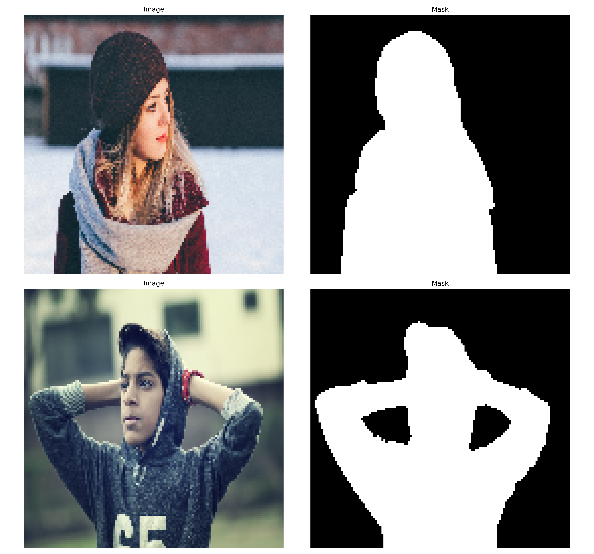
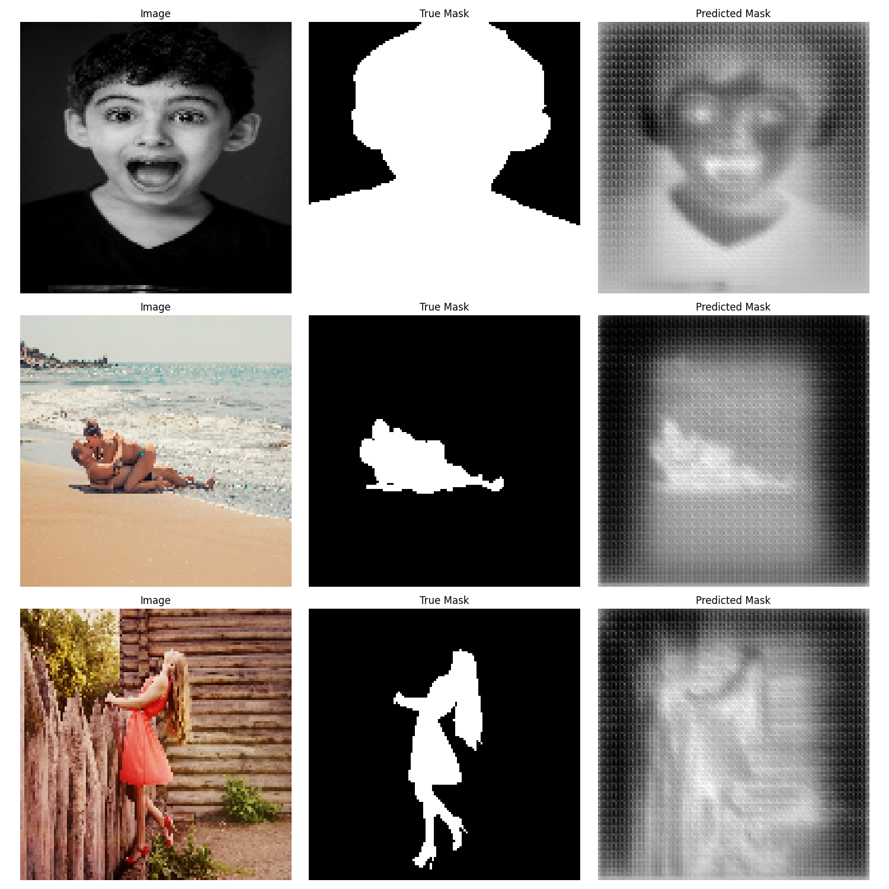
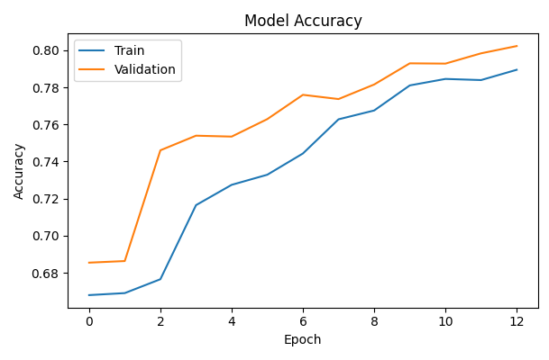

# UNet Image Segmentation Model
## Overview
This project features a U-Net model for human segmentation using the "Supervisely Person Dataset" available on Kaggle. The model effectively segments human figures from images by learning intricate features through multiple layers of neural networks.

Purpose or Motivation:
To explore deep learning for image segmentation, specifically isolating human figures from images. Potential applications include video editing, augmented reality, and autonomous driving.

Dataset Used:
Trained on the "Supervisely Person Dataset" from Kaggle, which contains high-quality images and corresponding binary masks for human segmentation.
## Inference
### Import necessary libraries:
```python 
# Importing necessary libraries
import os
import numpy as np
import tensorflow as tf
from tensorflow.keras.preprocessing.image import load_img, img_to_array, ImageDataGenerator
import matplotlib.pyplot as plt
from sklearn.model_selection import train_test_split
from tensorflow.keras.layers import Input, Conv2D, MaxPooling2D, Conv2DTranspose, concatenate, Dropout
from tensorflow.keras.models import Model
from tensorflow.keras.optimizers import Adam
from tensorflow.keras.callbacks import EarlyStopping

```


### Data Preparation

The data consists of images and corresponding masks stored in separate directories. The function 'load_data' is used to load and preprocess the images and masks:

```python 
def load_data(image_dir, mask_dir, image_size=(128, 128)):
    images = []
    masks = []
    
    for img_name in os.listdir(image_dir):
        img_path = os.path.join(image_dir, img_name)
        mask_path = os.path.join(mask_dir, img_name)
        
        image = load_img(img_path, target_size=image_size)
        mask = load_img(mask_path, target_size=image_size, color_mode="grayscale")
        
        image = img_to_array(image) / 255.0
        mask = img_to_array(mask) / 255.0
        mask = (mask > 0).astype(np.float32)
        
        images.append(image)
        masks.append(mask)
    
    return np.array(images), np.array(masks)

```
Load the data from the specified directories:

```python
image_dir = '/path/to/images'
mask_dir = '/path/to/masks'
image_size = (128, 128, 3)

images, masks = load_data(image_dir, mask_dir, image_size[:2])
```

### Model Architecture

The U-Net model is defined as follows:

```python 
def unet_model(input_size=(128, 128, 3)):
    inputs = Input(input_size)
    
    # Encoder
    c1 = Conv2D(64, 3, activation='relu', padding='same')(inputs)
    c1 = Conv2D(64, 3, activation='relu', padding='same')(c1)
    p1 = MaxPooling2D(pool_size=(2, 2))(c1)
    
    c2 = Conv2D(128, 3, activation='relu', padding='same')(p1)
    c2 = Conv2D(128, 3, activation='relu', padding='same')(c2)
    p2 = MaxPooling2D(pool_size=(2, 2))(c2)
    
    c3 = Conv2D(256, 3, activation='relu', padding='same')(p2)
    c3 = Conv2D(256, 3, activation='relu', padding='same')(c3)
    p3 = MaxPooling2D(pool_size=(2, 2))(c3)
    
    c4 = Conv2D(512, 3, activation='relu', padding='same')(p3)
    c4 = Conv2D(512, 3, activation='relu', padding='same')(c4)
    p4 = MaxPooling2D(pool_size=(2, 2))(c4)
    
    # Bottleneck
    c5 = Conv2D(1024, 3, activation='relu', padding='same')(p4)
    c5 = Conv2D(1024, 3, activation='relu', padding='same')(c5)
    
    # Decoder
    u6 = Conv2DTranspose(512, 2, strides=(2, 2), padding='same')(c5)
    u6 = concatenate([u6, c4])
    c6 = Conv2D(512, 3, activation='relu', padding='same')(u6)
    c6 = Conv2D(512, 3, activation='relu', padding='same')(c6)
    
    u7 = Conv2DTranspose(256, 2, strides=(2, 2), padding='same')(c6)
    u7 = concatenate([u7, c3])
    c7 = Conv2D(256, 3, activation='relu', padding='same')(u7)
    c7 = Conv2D(256, 3, activation='relu', padding='same')(c7)
    
    u8 = Conv2DTranspose(128, 2, strides=(2, 2), padding='same')(c7)
    u8 = concatenate([u8, c2])
    c8 = Conv2D(128, 3, activation='relu', padding='same')(u8)
    c8 = Conv2D(128, 3, activation='relu', padding='same')(c8)
    
    u9 = Conv2DTranspose(64, 2, strides=(2, 2), padding='same')(c8)
    u9 = concatenate([u9, c1])
    c9 = Conv2D(64, 3, activation='relu', padding='same')(u9)
    c9 = Conv2D(64, 3, activation='relu', padding='same')(c9)
    
    outputs = Conv2D(1, 1, activation='sigmoid')(c9)
    
    model = Model(inputs, outputs)
    return model
```


Initialize and compile the model:
```python
try:
    model = unet_model()
    optimizer = Adam(learning_rate=1e-5, clipvalue=1.0)
    model.compile(optimizer=optimizer, loss='binary_crossentropy', metrics=['accuracy'])
    print("Model compiled successfully.")
except Exception as e:
    print(f"Error compiling model: {e}")
```
Split data into training and testing sets:
```python
try:
    X_train, X_test, y_train, y_test = train_test_split(images, masks, test_size=0.2, random_state=42)
    print("Data split into training and testing sets successfully.")
except Exception as e:
    print(f"Error splitting data: {e}")
```
Define data augmentation:
```python
data_gen_args = dict(rotation_range=10.,
                     width_shift_range=0.1,
                     height_shift_range=0.1,
                     shear_range=0.2,
                     zoom_range=0.2,
                     horizontal_flip=True,
                     fill_mode='nearest')
image_datagen = ImageDataGenerator(**data_gen_args)
mask_datagen = ImageDataGenerator(**data_gen_args)

seed = 42
try:
    image_datagen.fit(X_train, augment=True, seed=seed)
    mask_datagen.fit(y_train, augment=True, seed=seed)
    
    image_generator = image_datagen.flow(X_train, batch_size=32, seed=seed)
    mask_generator = mask_datagen.flow(y_train, batch_size=32, seed=seed)
    
    train_generator = tf.data.Dataset.zip((tf.data.Dataset.from_generator(lambda: image_generator, output_signature=tf.TensorSpec(shape=(None, 128, 128, 3), dtype=tf.float32)),
                                           tf.data.Dataset.from_generator(lambda: mask_generator, output_signature=tf.TensorSpec(shape=(None, 128, 128, 1), dtype=tf.float32))))
    print("Data augmentation defined successfully.")
except Exception as e:
    print(f"Error defining data augmentation: {e}")
```
Early stopping:
```python
early_stopping = EarlyStopping(monitor='val_loss', patience=10, restore_best_weights=True)
print("Early stopping defined successfully.")
```
### Training

Compile and train the model:

```python

try:
    history = model.fit(train_generator, epochs=100, steps_per_epoch=len(X_train) // 32, 
                        validation_data=(X_test, y_test), callbacks=[early_stopping])
    print("Model trained successfully.")
except Exception as e:
    print(f"Error training model: {e}")

```
## Evaluation
Evaluate the model on the test set:


```python
loss, accuracy = model.evaluate(X_test, y_test)
print(f"Test Loss: {loss}")
print(f"Test Accuracy: {accuracy}")
```
Model evaluation - Loss: 0.5444254279136658, Accuracy: 0.7460329532623291


### Visualization

Visualize some samples:
```python
visualize_predictions(model, X_test, y_test)
```


Visualize the results on the test set:


```python
def visualize_predictions(model, X_test, y_test, num_samples=3):
    preds = model.predict(X_test)
    plt.figure(figsize=(10, num_samples * 5))
    for i in range(num_samples):
        plt.subplot(num_samples, 3, 3*i + 1)
        plt.imshow(X_test[i])
        plt.title("Image")
        plt.axis('off')

        plt.subplot(num_samples, 3, 3*i + 2)
        plt.imshow(y_test[i].reshape(image_size[:2]), cmap='gray')
        plt.title("True Mask")
        plt.axis('off')

        plt.subplot(num_samples, 3, 3*i + 3)
        plt.imshow(preds[i].reshape(image_size[:2]), cmap='gray')
        plt.title("Predicted Mask")
        plt.axis('off')

```



### Plot the training and validation accuracy and loss:
```python
def plot_training_history(history):
    epochs = range(1, len(history.history['accuracy']) + 1)

    plt.figure(figsize=(14, 5))

    plt.subplot(1, 2, 1)
    plt.plot(epochs, history.history['accuracy'], label='Training Accuracy')
    plt.plot(epochs, history.history['val_accuracy'], label='Validation Accuracy')
    plt.title('Training and Validation Accuracy')
    plt.xlabel('Epochs')
    plt.ylabel('Accuracy')
    plt.legend()

    plt.subplot(1, 2, 2)
    plt.plot(epochs, history.history['loss'], label='Training Loss')
    plt.plot(epochs, history.history['val_loss'], label='Validation Loss')
    plt.title('Training and Validation Loss')
    plt.xlabel('Epochs')
    plt.ylabel('Loss')
    plt.legend()

    plt.show()

# Call the function to plot training history
plot_training_history(history)
```

## Citation
Research paper used:
```
  author = {Ronneberger, Olaf and Fischer, Philipp and Brox, Thomas},
  title = {U-Net: Convolutional Networks for Biomedical Image Segmentation},
  journal = {Medical Image Computing and Computer-Assisted Intervention (MICCAI)},
  volume = {9351},
  pages = {234--241},
  year = {2015},
  publisher = {Springer},
  doi = {10.1007/978-3-319-24574-4_28},

```
Dataset used:
```python

  author = {Supervisely},
  title = {Supervisely Person Dataset},
  year = {2024},
  howpublished = {\url{https://www.kaggle.com/datasetlink}},
  dataset = {Supervisely Person Dataset, Kaggle},


```

